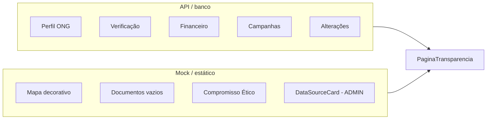

# Estado de integração e mocks do frontend

**Última atualização:** 8 de junho de 2026  
**Branch de referência:** `feat/demock-NGO-transparency-page`

Este documento substitui os backlogs antigos (`docs/backlog/*`) e o `DEMOCKING_ROADMAP.md`. Ele descreve o que está integrado à API, o que ainda é mock ou placeholder, e o que é conteúdo estático/editorial.

---

## Legenda

| Status | Significado |
|--------|-------------|
| **API** | Dados carregados de endpoints reais |
| **Parcial** | Mix de API + mock, fallback ou UI sem backend |
| **Mock** | Dados fictícios, `localStorage` ou hardcoded |
| **Estático** | Copy de marketing ou exemplos ilustrativos (sem pretensão de ser dado dinâmico) |

---

## Página de transparência da ONG

**Rota:** `/ong/:uuid/transparency`  
**Arquivos:** `NgoTransparencyPage.jsx`, `useTransparency.js`, `transparencyService.js`

### Integrado à API

| Bloco | Endpoint | Observação |
|-------|----------|------------|
| Nome, CNPJ, localização, anos de operação | `GET /v1/ngos/{id}/` | Via `transparencyService.getNGOProfile` |
| Score, badge verificado, evidências | `GET /v1/ngos/{id}/verification/` | Evidências derivadas de flags no banco |
| Utilização orçamentária, auditoria, status | `GET /v1/transparency/ngos/{id}/financial-data/` | |
| Status de Verificação (card completo) | `GET /v1/ngos/{id}/verification/` | Componente `VerificationStatus` |
| Histórico de campanhas | `GET /v1/ngos/{id}/campaigns/` | Mapeado em `transparencyService` |
| Histórico de alterações | `GET /v1/transparency/ngos/{id}/change-history/` | Mapeado em `transparencyService` |
| Solicitações pendentes (NGO/ADMIN) | `GET /v1/transparency/ngos/{id}/pending-requests/` | |
| Enviar / aprovar / rejeitar alteração | `POST` em `/v1/transparency/...` | Corrigido envio de `ongId` e campos snake_case |

### Ainda mock, placeholder ou estático

| Bloco | Tipo | Detalhe |
|-------|------|---------|
| Mapa da sede | Estático | SVG decorativo; só o texto da cidade vem da API |
| Documentos públicos | Placeholder | Empty state honesto — **não há endpoint de documentos** |
| Compromisso Ético | Estático | Copy institucional fixo com nome da ONG interpolado |
| Subtítulo do hero + descrição do score | Estático | Texto de marketing |
| Label do score (A+, Excelente…) | Calculado | Regra no frontend a partir do score da API |
| **Fontes de Dados** (`DataSourceCard`) | Mock | Só com `?role=ADMIN` — timestamps e fontes fixos |
| **Painel de Consistência** | Parcial | Score da API; “Auditoria Ativa / Monitorando” é hardcoded |
| Upload de anexo (formulário NGO) | Mock | UI only, sem persistência |

### Ressalva: verificação vs. validação em tempo real

O bloco **Status de Verificação** não revalida Receita Federal ou CEP ao abrir a página. O backend monta as evidências a partir de campos persistidos no modelo `NGO` (`is_active`, `address_valid`, `years_operating`). A validação externa ocorre no fluxo `POST /api/ong-validation/` (cadastro); a página apenas **exibe** o estado gravado.

No ambiente demo, esses flags vêm do `seed_demo_ngos` — são fictícios, mas **não são hardcoded no React**.



---

## Inventário por página

| Página | Rota | Status | O que ainda é mock / incompleto |
|--------|------|--------|----------------------------------|
| **NgoTransparencyPage** | `/ong/:id/transparency` | Parcial | Ver seção acima |
| **TransparencyPage** | `/transparencia` | API | Critérios de alocação têm fallback hardcoded se a API falhar (`globalTransparencyService`) |
| **CausesPage** | `/causas` | API | ONGs, campanhas e bundles da API; capas são assets fixos por índice |
| **NgoProfilePage** | `/ong/:id` | Parcial | Perfil e campanhas via API; `DEFAULT_BENEFITS` estático; urgência via **localStorage** |
| **BundleDetailPage** | `/bundles/:id` | API | Bundle da API; capa sorteada de pool de imagens |
| **DonationPage** | `/doacao` | Parcial | Contexto ONG/campanha via API; `causesList` hardcoded no fluxo “fundo genérico” |
| **DonorProfilePage** | `/perfil-doador` | API | `donorProfileService` → `/v1/donors/*`; recibo gerado no cliente (`.txt`) |
| **NgoManagementPage** | `/gestao-ong` | Parcial | Campanhas e score via API; aba Relatórios com histórico PDF mock; export sem backend; fallback `'Maio 2026'` na auditoria; cadastro com `alert()` fake |
| **UrgencyRequestPage** | `/urgencia` | Mock | Fluxo inteiro em **localStorage** (`urgencyRequestService`) |
| **AboutPage** | `/sobre` | Estático | Exemplos ilustrativos (nomes/score/recibo fictícios no copy) |
| **LandingPage** | `/` | Estático | Marketing |
| **RegisterPage** | `/cadastro` | API | Lista de causas no form é estática (ok); registro chama API |
| **LoginPage** | `/login` | API | Auth real |
| **ChangePasswordPage** | `/alterar-senha` | API | Auth real |
| **SettingsPage** | `/configuracoes` | Parcial | Salva só em `localStorage` via `updateUser` — sem PATCH no backend |

---

## Componentes e serviços transversais

| Artefato | Usado em | Status | Notas |
|----------|----------|--------|-------|
| `urgencyRequestService` | Gestão ONG, perfil ONG, wizard | **Mock** | `localStorage` (`@ongplus:urgency_requests`) |
| `DataSourceCard` | Transparência (`?role=ADMIN`) | **Mock** | Receita, Brasil API, sync fictícios |
| `ConsistencyPanel` | Transparência (`?role=ADMIN`) | **Parcial** | “Monitorando” fixo |
| `globalTransparencyService` | `/transparencia` | **API** + fallback | Critérios hardcoded se `allocation-criteria` falhar |
| `ongs.js` (`ONG_CATALOG`) | — | **Morto** | Catálogo estático não importado em nenhum lugar |
| `transparencyService` | Transparência ONG | **API** | Mapeamento centralizado de campanhas, alterações e solicitações |

---

## Endpoints de transparência (referência)

### Já consumidos pelo frontend

```
GET  /v1/ngos/{id}/
GET  /v1/ngos/{id}/verification/
GET  /v1/ngos/{id}/campaigns/
GET  /v1/transparency/ngos/{id}/financial-data/
GET  /v1/transparency/ngos/{id}/change-history/
GET  /v1/transparency/ngos/{id}/pending-requests/
POST /v1/transparency/ngos/{id}/requests/
POST /v1/transparency/requests/{id}/approve/
POST /v1/transparency/requests/{id}/reject/
GET  /v1/transparency/global-metrics/
GET  /v1/transparency/recent-transfers/
GET  /v1/transparency/allocation-criteria/
```

### Ainda sem implementação / consumo

```
GET  /v1/transparency/ngos/{id}/documents/     # documentos públicos da ONG
POST /v1/ngos/{id}/reports/generate/           # export PDF na gestão
POST /v1/ngos/{id}/audit/upload/               # enviar auditoria na gestão
GET  /v1/ngos/{id}/data-sources/               # painel admin de fontes
API  urgência (CRUD)                           # substituir localStorage
PATCH /v1/users/me/ ou equivalente             # configurações de conta
```

---

## Prioridades sugeridas

Ordem recomendada para reduzir mocks com maior impacto no MVP:

1. **Urgência** — migrar `urgencyRequestService` para API Django
2. **Gestão ONG — Relatórios** — endpoint de geração/export e histórico real
3. **Documentos públicos** — endpoint + upload na transparência da ONG
4. **AboutPage** — alinhar exemplos aos nomes fictícios do seed (ou tornar genéricos)
5. **DonationPage** — remover ou conectar `causesList` ao backend
6. **SettingsPage** — persistir perfil no backend
7. **Painel ADMIN** (`DataSourceCard`, `ConsistencyPanel`) — dados reais ou ocultar até existir API

---

## Dados de demonstração (seed)

ONGs fictícias definidas em `backend/verification/management/commands/seed_demo_ngos.py`:

| Nome | CNPJ fictício | Causa |
|------|---------------|-------|
| Instituto Mata Viva | 10.200.300/0001-70 | Meio ambiente |
| Fundação Rio Puro | 20.300.400/0001-81 | Saúde |
| Rede Aprender Juntos | 30.400.500/0001-92 | Educação |
| Coletivo Cidadania Ativa | 40.500.600/0001-03 | Direitos humanos |

Reexecutar após mudanças no seed:

```bash
cd backend
python manage.py seed_demo_ngos
```

---

## Arquivos relacionados

| Área | Caminhos principais |
|------|---------------------|
| Transparência ONG | `frontend/src/Pages/NgoTransparencyPage.jsx`, `hooks/useTransparency.js`, `services/transparencyService.js` |
| Transparência global | `frontend/src/Pages/TransparencyPage.jsx`, `hooks/useGlobalTransparency.js`, `services/globalTransparencyService.js` |
| Backend transparência | `backend/transparency/views.py`, `backend/verification/ngo_response.py` |
| Urgência (mock) | `frontend/src/services/urgencyRequestService.js`, `components/urgency/*` |
| Seed demo | `backend/verification/management/commands/seed_demo_ngos.py` |

---

## Histórico deste documento

- **Jun/2026** — Substitui `docs/backlog/frontend.md`, `docs/backlog/backend.md`, `docs/backlog/integracao-produto.md` e `docs/DEMOCKING_ROADMAP.md`
- Consolida auditoria da página `/ong/:uuid/transparency` e inventário geral de mocks do frontend
