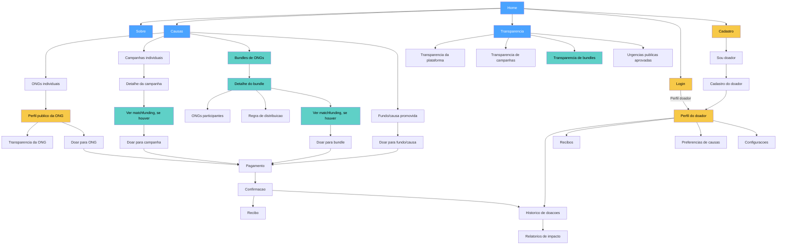

```mermaid
flowchart TD
    Home["Home"]
    Sobre["Sobre"]
    Causas["Causas"]
    Transparencia["Transparencia"]
    Login["Login"]
    Cadastro["Cadastro"]

    Home --> Sobre
    Home --> Causas
    Home --> Transparencia
    Home --> Login
    Home --> Cadastro

    Cadastro --> SouDoador["Sou doador"]
    SouDoador --> CadastroDoador["Cadastro do doador"]
    CadastroDoador --> PerfilDoador["Perfil do doador"]

    Login -- "Perfil doador" --> PerfilDoador

    Causas --> ONGs["ONGs individuais"]
    Causas --> Campanhas["Campanhas individuais"]
    Causas --> Bundles["Bundles de ONGs"]

    ONGs --> PerfilONG["Perfil publico da ONG"]
    Campanhas --> DetalheCampanha["Detalhe da campanha"]
    Bundles --> DetalheBundle["Detalhe do bundle"]

    PerfilONG --> TransparenciaONG["Transparencia da ONG"]
    PerfilONG --> DoarONG["Doar para ONG"]

    DetalheCampanha --> MatchCampanha["Ver matchfunding, se houver"]
    MatchCampanha --> DoarCampanha["Doar para campanha"]

    DetalheBundle --> ONGsParticipantes["ONGs participantes"]
    DetalheBundle --> RegraDistribuicao["Regra de distribuicao"]
    DetalheBundle --> MatchBundle["Ver matchfunding, se houver"]
    MatchBundle --> DoarBundle["Doar para bundle"]

    Causas --> FundoCausa["Fundo/causa promovida"]
    FundoCausa --> DoarFundo["Doar para fundo/causa"]

    DoarONG --> Pagamento["Pagamento"]
    DoarCampanha --> Pagamento
    DoarBundle --> Pagamento
    DoarFundo --> Pagamento

    Pagamento --> Confirmacao["Confirmacao"]
    Confirmacao --> Recibo["Recibo"]
    Confirmacao --> Historico["Historico de doacoes"]
    Historico --> Relatorios["Relatorios de impacto"]

    Transparencia --> TransparenciaPlataforma["Transparencia da plataforma"]
    Transparencia --> TransparenciaCampanhas["Transparencia de campanhas"]
    Transparencia --> TransparenciaBundles["Transparencia de bundles"]
    Transparencia --> UrgenciasPublicas["Urgencias publicas aprovadas"]

    PerfilDoador --> Historico
    PerfilDoador --> Recibos["Recibos"]
    PerfilDoador --> Preferencias["Preferencias de causas"]
    PerfilDoador --> Configuracoes["Configuracoes"]

    classDef naoImplementado fill:#ff5a36,color:#fff;
    classDef parcial fill:#f7c948,color:#000;
    classDef planejado fill:#5fd0c7,color:#000;
    classDef completo fill:#4aa3ff,color:#fff;

    class Home,Sobre,Causas,Transparencia completo;
    class Login,Cadastro,PerfilDoador,PerfilONG parcial;
    class Bundles,DetalheBundle,MatchCampanha,MatchBundle,TransparenciaBundles planejado;
```
