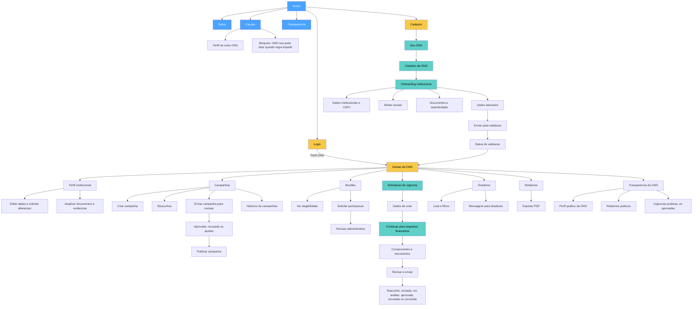

```mermaid
flowchart TD
    Home["Home"]
    Sobre["Sobre"]
    Causas["Causas"]
    Transparencia["Transparencia"]
    Login["Login"]
    Cadastro["Cadastro"]

    Home --> Sobre
    Home --> Causas
    Home --> Transparencia
    Home --> Login
    Home --> Cadastro

    Cadastro --> SouONG["Sou ONG"]
    SouONG --> CadastroONG["Cadastro da ONG"]
    CadastroONG --> Onboarding["Onboarding institucional"]
    Onboarding --> Dados["Dados institucionais e CNPJ"]
    Onboarding --> Redes["Redes sociais"]
    Onboarding --> Documentos["Documentos e autenticidade"]
    Onboarding --> Bancarios["Dados bancarios"]
    Bancarios --> EnviarValidacao["Enviar para validacao"]
    EnviarValidacao --> StatusValidacao["Status de validacao"]

    Login -- "Perfil ONG" --> GestaoONG["Gestao da ONG"]
    StatusValidacao --> GestaoONG

    GestaoONG --> Perfil["Perfil institucional"]
    GestaoONG --> Campanhas["Campanhas"]
    GestaoONG --> Bundles["Bundles"]
    GestaoONG --> Urgencia["Solicitacao de urgencia"]
    GestaoONG --> Doadores["Doadores"]
    GestaoONG --> Relatorios["Relatorios"]
    GestaoONG --> TransparenciaONG["Transparencia da ONG"]

    Perfil --> EditarPerfil["Editar dados e solicitar alteracoes"]
    Perfil --> AtualizarDocs["Atualizar documentos e evidencias"]

    Campanhas --> CriarCampanha["Criar campanha"]
    Campanhas --> Rascunhos["Rascunhos"]
    Campanhas --> RevisaoCampanha["Enviar campanha para revisao"]
    RevisaoCampanha --> StatusCampanha["Aprovada, recusada ou ajustes"]
    StatusCampanha --> PublicarCampanha["Publicar campanha"]
    Campanhas --> HistoricoCampanhas["Historico de campanhas"]

    Bundles --> VerElegibilidade["Ver elegibilidade"]
    Bundles --> ParticiparBundle["Solicitar participacao"]
    ParticiparBundle --> RevisaoBundle["Revisao administrativa"]

    Urgencia --> DadosUrgencia["Dados da crise"]
    DadosUrgencia --> RequisitosFinanceiros["Continuar para requisitos financeiros"]
    RequisitosFinanceiros --> EvidenciasUrgencia["Comprovantes e documentos"]
    EvidenciasUrgencia --> RevisarUrgencia["Revisar e enviar"]
    RevisarUrgencia --> StatusUrgencia["Rascunho, enviada, em analise, aprovada, recusada ou concluida"]

    Doadores --> ListaDoadores["Lista e filtros"]
    Doadores --> Mensagens["Mensagens para doadores"]
    Relatorios --> ExportarPDF["Exportar PDF"]

    TransparenciaONG --> PerfilPublico["Perfil publico da ONG"]
    TransparenciaONG --> RelatoriosPublicos["Relatorios publicos"]
    TransparenciaONG --> UrgenciasPublicas["Urgencias publicas, se aprovadas"]

    Causas --> PerfilOutraONG["Perfil de outra ONG"]
    Causas --> RestricaoDoacao["Bloqueio: ONG nao pode doar quando regra impedir"]

    classDef naoImplementado fill:#ff5a36,color:#fff;
    classDef parcial fill:#f7c948,color:#000;
    classDef planejado fill:#5fd0c7,color:#000;
    classDef completo fill:#4aa3ff,color:#fff;

    class Home,Sobre,Causas,Transparencia completo;
    class Login,Cadastro,GestaoONG parcial;
    class SouONG,CadastroONG,Onboarding,Urgencia,RequisitosFinanceiros planejado;
```
